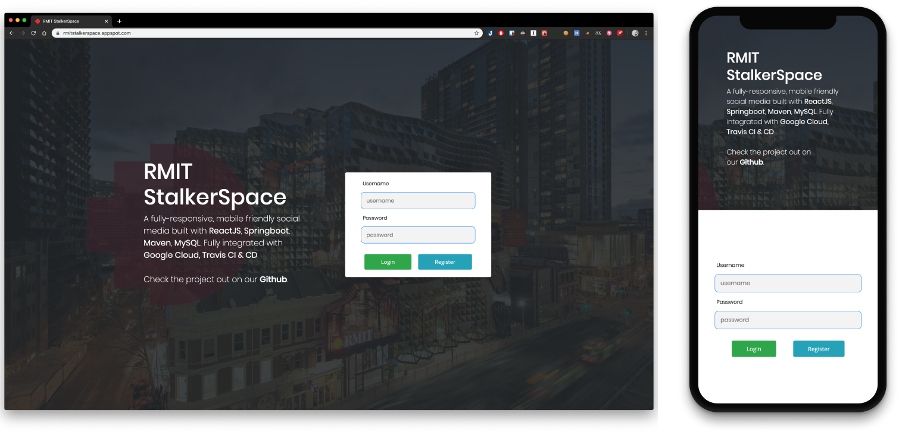
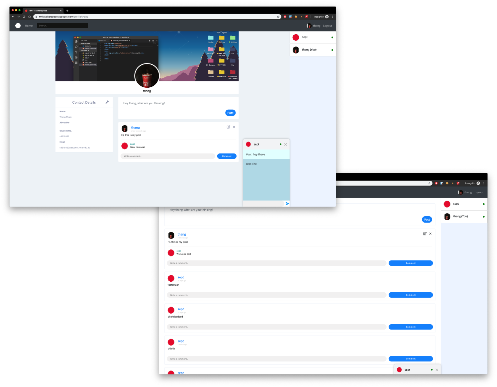

<p align="center">
  <a href="#"></a>
  <a href="#"></a>
  <a href="#"></a>
</p>

# RMIT REST API Social Media

A full-stack, mobile friendly social media platform using Sprint Boot Maven. 

## Live Demo:
https://rmitsocial.herokuapp.com/
> Due to lack of funding, the demo is missing the following tech stacks: `Google App Engine`, `MySQL`
## Features / Functionality:

- Central Authentication API - Login/Register/Validation
- User profile wall - including personal information, avatar, background cover
- CRUD User status, comments on user status
- Hot reload on user's update
- Private Message

## Preview





## Technologies:
- Backend: **Spring Boot**, **Maven**
- Frontend: **ReactJS**
- Middleware: **JWT**, **Websocket**, **JPA**
- Database: **MySQL**, **H2 Database Engine**
- CI & CD: **TravisCI**, **Google Cloud App Engine**
- Testing: 
  - Unit Testing:
    - Front end: **JEST.js**
    - Back end: **JUnit**
  - Integration test: **WebdriverIO**

## Development tools & Methodology
- Scrum
- Trello

## Communication tools:
- Slack
## Installation:
#### Start backend server

After cloning the project, please `cd restful-web-service` and run
```
mvn spring-boot:run
```
The server should be starting on port `8080`

#### Start frontend client website
Run `cd frontend/todo-app/` from the root folder run
```
npm install
```
And then 
```
npm start
```
the client should be starting on port `4200`

## Testing

### For Unit test.
Back end:
```bash
mvn install
mvn test -B
```
Front end:
```bash
yarn install
npm run test
```
### For Integration test.
Leave the server back end running, with the client (`npm start`) running, cd to `frontend/todo-app` and run
```
npm run wdio
```
*Requires to have chrome version 77 and above*

## Contributor:
- [Austin (Thang Pham)](https://github.com/rockmanvnx6)
- [Lam Tran](https://github.com/s3714110)
- [Duy Nguyen](https://github.com/nugyn)
- [Dharal Patel](https://github.com/DharalPatel)
